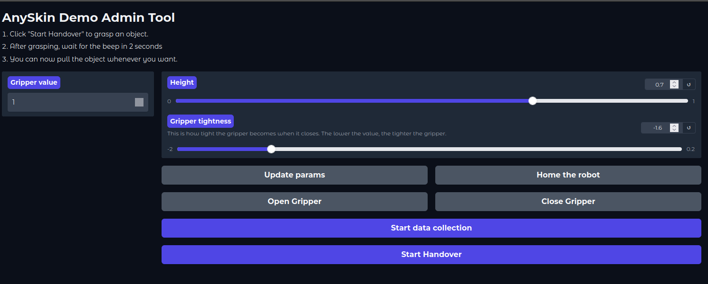

# Acknowledgement

The slip detection section of this repository is heavily drawn from the [AnySkin handoff demo](https://github.com/NYU-robot-learning/AnySkin-Handoff-Demo).\
Credits: [Enes Erciyes](https://eneserciyes.github.io/)

# Set up

```bash
conda create -n 'slip_detection' python=3.10 
```

```bash
conda activate slip_detection
python3 -m pip install -r requirements.txt
```

# Starting UI

1. Home the robot:

```bash
stretch_robot_home.py
```

2. Make sure venv is not activated. Create different terminal panes in Tmux, run:
	
- robot server without activating conda:
```bash
cd robot_server
python3 start_server.py
```
Robot should move to the home position.
- Activate conda and reskin server:
```bash
conda activate anyskin
python3 reskin_server.py
```
if didn't start streaming, try a different port (it's either ACM5 which is the default or ACM6):
```
python3 reskin_server.py reskin_config.port="/dev/ttyACM6"
```
- Start the UI:
```bash
conda activate anyskin
python3 run.py
```

3. Forward port 7860, and go to `localhost:7860`. You will see the demo UI:



If you want to change the gripper tightness or the height of the arm, play with the sliders, then click "Update Params" and "Home the robot" in this order.

To do the demo:
- Place an object between grippers and click "Start Handover"
- Grippers will close 
- Wait until the robot beeps
- NOTE: it's important to let go of the object after grasping (I baseline the readings in this period)

- Then, you can pull it whenever you want. 
- NOTE: This demo is very robust. However, the longer object stays in the gripper, the likelier a false positive and gripper will open on its own. I tested up to 30 seconds for many objects and tested this by disturbing the robot.